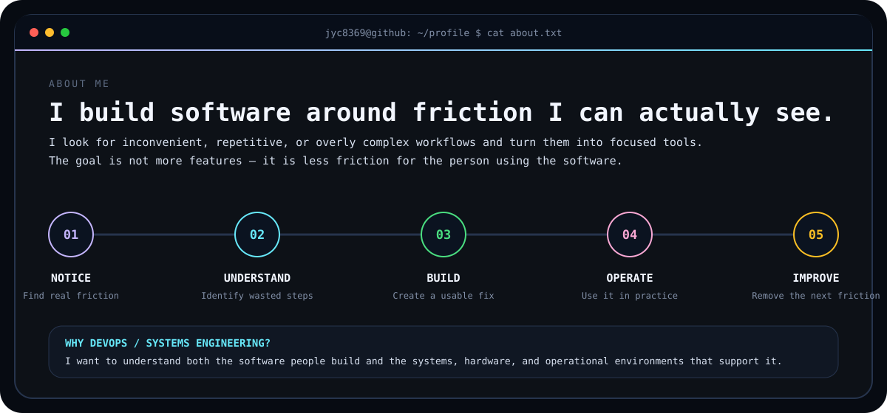
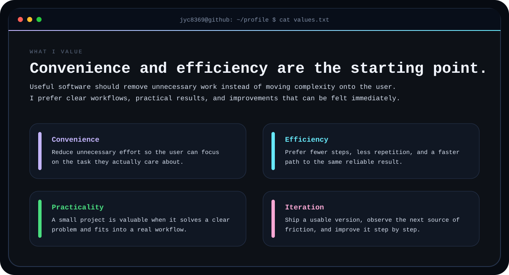
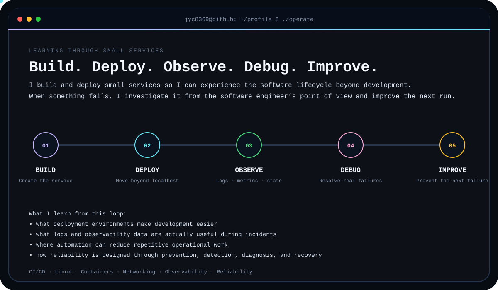
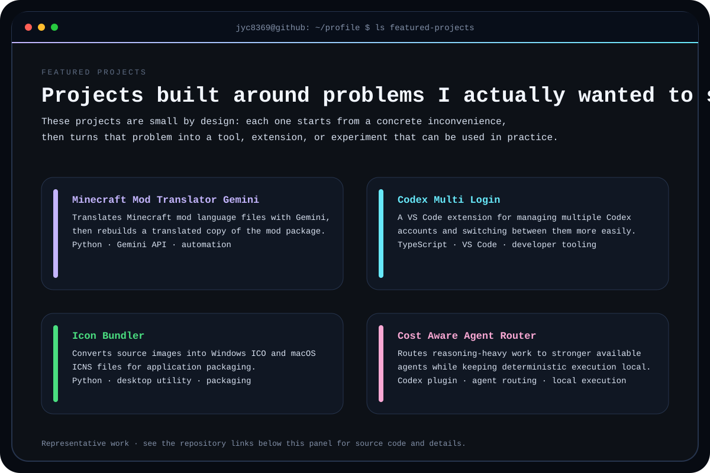
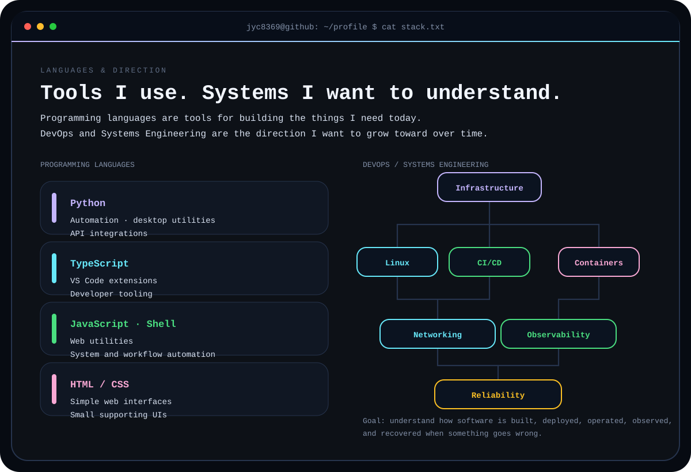

# Profile Details

[← Back to the main profile](./README.md)

## About Me

<picture>
  <source media="(prefers-color-scheme: dark)" srcset="./assets/profile/about-dark.svg">
  <source media="(prefers-color-scheme: light)" srcset="./assets/profile/about-light.svg">
  
</picture>

## What I Value

<picture>
  <source media="(prefers-color-scheme: dark)" srcset="./assets/profile/values-dark.svg">
  <source media="(prefers-color-scheme: light)" srcset="./assets/profile/values-light.svg">
  
</picture>

## Learning Through Small Services

<picture>
  <source media="(prefers-color-scheme: dark)" srcset="./assets/profile/lifecycle-dark.svg">
  <source media="(prefers-color-scheme: light)" srcset="./assets/profile/lifecycle-light.svg">
  
</picture>

## Featured Projects

<picture>
  <source media="(prefers-color-scheme: dark)" srcset="./assets/profile/projects-dark.svg">
  <source media="(prefers-color-scheme: light)" srcset="./assets/profile/projects-light.svg">
  
</picture>

  <strong>View source:</strong> 
  <a href="https://github.com/jyc8369/Minecraft_Mod_Translator_Gemini">Minecraft Mod Translator Gemini</a>
  · <a href="https://github.com/jyc8369/Codex_Multi_Login">Codex Multi Login</a>
  · <a href="https://github.com/jyc8369/Icon_Bundler">Icon Bundler</a>
  · <a href="https://github.com/jyc8369/Cost_Aware_Agent_Router">Cost Aware Agent Router</a>

## Languages & Direction

<picture>
  <source media="(prefers-color-scheme: dark)" srcset="./assets/profile/stack-dark.svg">
  <source media="(prefers-color-scheme: light)" srcset="./assets/profile/stack-light.svg">
  
</picture>

[All repositories](https://github.com/jyc8369?tab=repositories)
