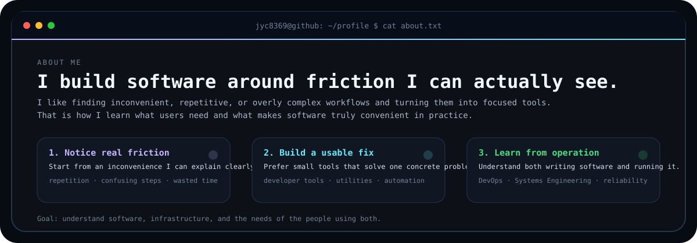
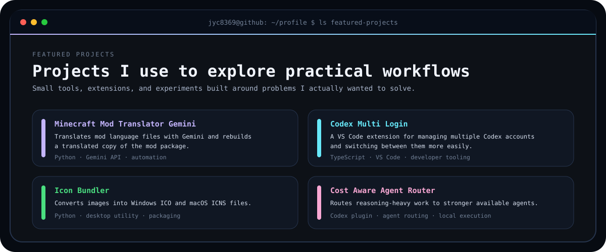

<picture>
  <source media="(prefers-color-scheme: dark)" srcset="./dark.svg">
  <source media="(prefers-color-scheme: light)" srcset="./light.svg">
  
</picture>

# jyc8369

**Hobbyist developer building practical tools and small services.**  
I care about **convenience, efficiency, and operating what I build**.  
Long-term direction: **DevOps · Systems Engineering**

[View all repositories](https://github.com/jyc8369?tab=repositories)

<picture>
  <source media="(prefers-color-scheme: dark)" srcset="./about-dark.svg">
  <source media="(prefers-color-scheme: light)" srcset="./about-light.svg">
  
</picture>

<picture>
  <source media="(prefers-color-scheme: dark)" srcset="./values-dark.svg">
  <source media="(prefers-color-scheme: light)" srcset="./values-light.svg">
  
</picture>

<picture>
  <source media="(prefers-color-scheme: dark)" srcset="./lifecycle-dark.svg">
  <source media="(prefers-color-scheme: light)" srcset="./lifecycle-light.svg">
  
</picture>

<picture>
  <source media="(prefers-color-scheme: dark)" srcset="./projects-dark.svg">
  <source media="(prefers-color-scheme: light)" srcset="./projects-light.svg">
  
</picture>

<picture>
  <source media="(prefers-color-scheme: dark)" srcset="./stack-dark.svg">
  <source media="(prefers-color-scheme: light)" srcset="./stack-light.svg">
  
</picture>
