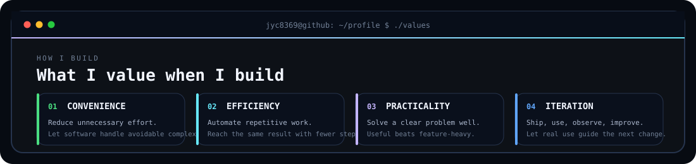
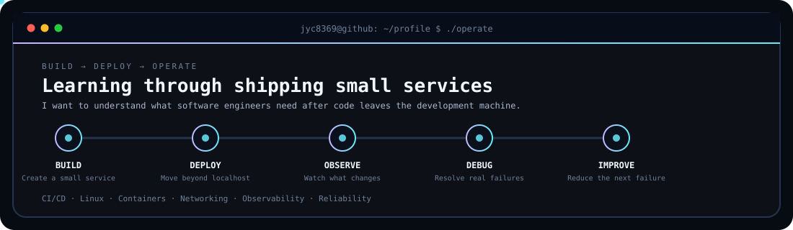
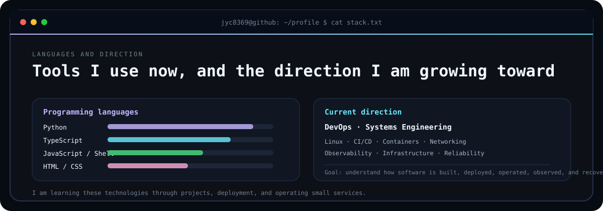

<picture>
  <source media="(prefers-color-scheme: dark)" srcset="./dark.svg">
  <source media="(prefers-color-scheme: light)" srcset="./light.svg">
  
</picture>

# jyc8369

**Hobbyist developer learning to build, deploy, and operate practical software.**

I look for friction in everyday technical workflows and think about how software can make them more **convenient and efficient**.

My long-term direction is **DevOps and Systems Engineering**.

[View all repositories](https://github.com/jyc8369?tab=repositories)

<picture>
  <source media="(prefers-color-scheme: dark)" srcset="./values-dark.svg">
  <source media="(prefers-color-scheme: light)" srcset="./values-light.svg">
  
</picture>

## About Me

I develop software as a hobby and use each project to understand real problems from the user's point of view. When something feels repetitive, inconvenient, or unnecessarily complicated, I try to identify the source of the friction and build a focused solution around it.

Because I want to grow toward **DevOps and Systems Engineering**, I also want to understand what software engineers actually need from the systems and hardware that support their work. I am interested in both sides of the boundary: writing software and operating the environment that keeps it running.

<picture>
  <source media="(prefers-color-scheme: dark)" srcset="./lifecycle-dark.svg">
  <source media="(prefers-color-scheme: light)" srcset="./lifecycle-light.svg">
  
</picture>

## Learning Through Small Services

I build and deploy small services so I can experience more of the software lifecycle than development alone. When a deployed service fails, I try to investigate the problem from the software engineer's point of view, resolve it, and then ask what could make the same failure easier to prevent, detect, diagnose, or recover from next time.

That process is how I am learning why **automation, observability, deployment workflows, infrastructure, and reliability** matter in practice.

## Featured Projects

| Project | What it does | Main technologies |
|:--|:--|:--|
| [Minecraft Mod Translator Gemini](https://github.com/jyc8369/Minecraft_Mod_Translator_Gemini) | Finds Minecraft mod language files, translates them with Gemini, and creates a translated copy of the mod. | `Python` `Gemini API` |
| [Icon Bundler](https://github.com/jyc8369/Icon_Bundler) | Converts PNG and JPEG images into Windows ICO or macOS ICNS icon files. | `Python` |
| [Codex Multi Login](https://github.com/jyc8369/Codex_Multi_Login) | A VS Code extension for managing multiple Codex accounts and switching between them more easily. | `TypeScript` `VS Code` |
| [Cost Aware Agent Router](https://github.com/jyc8369/Cost_Aware_Agent_Router) | A Codex plugin that delegates reasoning-heavy work to stronger available agents while keeping deterministic execution local. | `Codex Plugin` `Agent Routing` |

<picture>
  <source media="(prefers-color-scheme: dark)" srcset="./stack-dark.svg">
  <source media="(prefers-color-scheme: light)" srcset="./stack-light.svg">
  
</picture>

## Current Direction

My goal is to become an engineer who understands not only how software is written, but also how it is **built, deployed, operated, observed, and recovered when something goes wrong**.

I am currently exploring `Linux`, `CI/CD`, `Containers`, `Networking`, `Observability`, `Infrastructure`, `Automation`, and `Reliability` while continuing to build small tools and services.
