<picture>
  <source media="(prefers-color-scheme: dark)" srcset="./dark.svg">
  <source media="(prefers-color-scheme: light)" srcset="./light.svg">
  
</picture>

# jyc8369

**작고 구체적인 문제를 해결하는 실용적인 소프트웨어를 만듭니다.**

반복 작업은 자동화하고, 아이디어는 실제로 사용할 수 있는 도구로 구현합니다.  
작은 범위에서 빠르게 만들고, 반복 개선하며, 사용 방법까지 문서화합니다.

[전체 저장소](https://github.com/jyc8369?tab=repositories)

---

## 작업 영역

- **Desktop utilities** — 파일 변환, 로컬 작업, 반복 과정 단순화
- **AI-assisted automation** — AI API를 실제 작업 흐름에 연결하는 도구
- **Developer tooling** — VS Code 확장, Codex 플러그인, 개발 환경 보조

## 대표 프로젝트

| 프로젝트 | 해결하는 문제 | 주요 기술 |
|:--|:--|:--|
| [Minecraft Mod Translator Gemini](https://github.com/jyc8369/Minecraft_Mod_Translator_Gemini) | Minecraft 모드의 언어 파일을 Gemini로 번역하고 새 JAR을 생성합니다. | `Python` `Gemini API` |
| [Icon Bundler](https://github.com/jyc8369/Icon_Bundler) | PNG·JPG 이미지를 Windows용 ICO 또는 macOS용 ICNS로 변환합니다. | `Python` |
| [Codex Multi Login](https://github.com/jyc8369/Codex_Multi_Login) | 여러 Codex 계정을 저장하고 전환할 수 있는 VS Code 확장입니다. | `TypeScript` `VS Code` |
| [Cost Aware Agent Router](https://github.com/jyc8369/Cost_Aware_Agent_Router) | 추론이 필요한 작업만 더 강한 가용 에이전트에 위임하는 Codex 플러그인입니다. | `Codex Plugin` |

## 기술과 관심 영역

`Python` · `TypeScript` · `JavaScript` · `HTML/CSS` · `Shell`  
`Desktop Apps` · `VS Code Extensions` · `AI APIs` · `Automation`

## 작업 방식

1. **Utility first** — 기능을 늘리기 전에 해결할 문제를 먼저 정합니다.
2. **Small and complete** — 범위를 작게 유지하되 실제로 사용할 수 있는 상태까지 만듭니다.
3. **Document the workflow** — 설치 방법, 사용 과정, 제약사항을 저장소에 남깁니다.

프로필 쇼케이스 설정 파일

- [소개 원문](./ABOUT.md)
- [자동 가져오기 규격](./SHOWCASE_IMPORT.md)
- [쇼케이스 설정](./showcase.json)

