<picture>
  <source media="(prefers-color-scheme: dark)" srcset="./assets/profile/banner-dark.svg">
  <source media="(prefers-color-scheme: light)" srcset="./assets/profile/banner-light.svg">
  
</picture>

# jyc8369

**Hobbyist developer building practical tools and small services.**  
I care about **convenience, efficiency, and operating what I build**.  
Long-term direction: **DevOps · Systems Engineering**

### [Read the detailed profile →](./docs/PROFILE.md)

